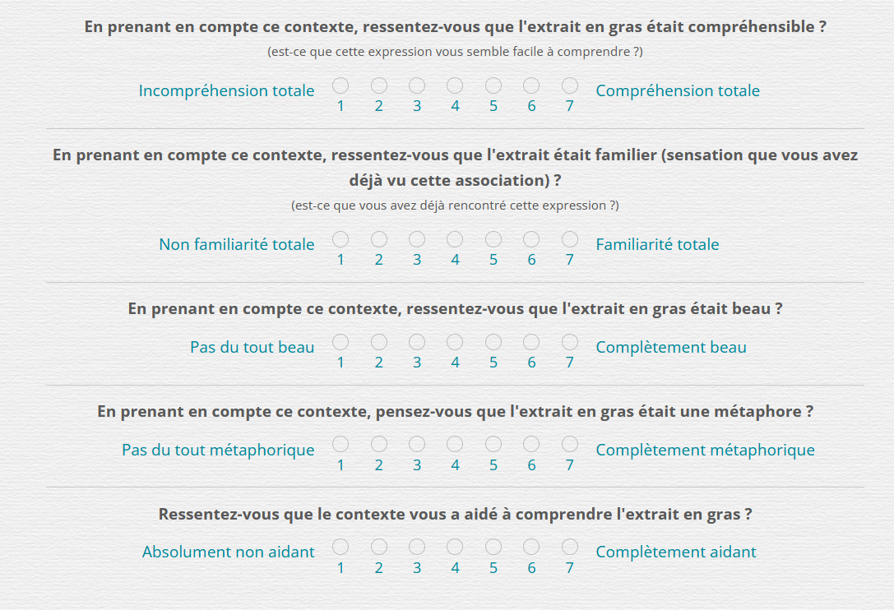

## Metaphor? An online experiment to evaluate the metaphorical aspect of expressions _(onx\_metaphor-context)_
### 

Online experiment to collect evaluation scores on groups of words embedded in a text (comprehension, familiarity, beauty, metaphorical character). A knowledge test on writers' names and a form to collect various data (reading habits) are also implemented.
 
The experiment was built using the [jsPsych library](https://www.jspsych.org), and  customized plugins have been created in /lib/jspsych/:
* _jspsych_addons.js:_ a set of usefull functions for the experiment
* _plugins/jspsych-form-rating.js:_ specific plugin for the rating task
* _plugins/jspsych-form-author.js:_ specific plugin for the author name task

**Figure 1** Example of the rating task

The experiment was developped and configured on the server by C. Zielinski (CREx/ILCB/LPL) for the needs of Marion Fechino's research work (AMU/LPC).
